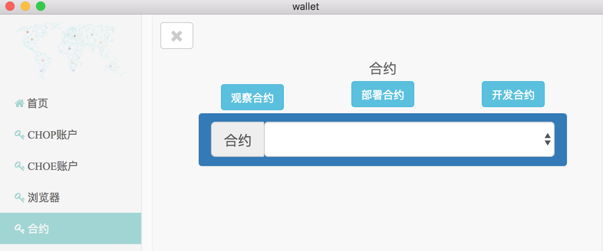

<h1 align="center">智能合约</h1>
安链支持solidity智能合约，你可以编写自己想要的DAPP逻辑，部署于安链并调用运行  

   你可以使用[钱包](https://github.com/annchain/ann-wallet)进行合约操作   
   

   这里仅介绍通过anntool进行合约部署的方式
### 合约部署
    ./anntool  evm create -callf sample.json --abif sample.abi --nonce 0  
callf参数用于指定创建合约所需要的一些参数，格式如下:  

    {
      "privkey" : "",  //创建合约所用的账户私钥
      "bytecode" : "", //合约的bytecode
      "params" :[]     //如果部署操作有构造函数，填写合约构造函数的参数
    }
abif参数用于指定创建合约所需要的abiDefinition信息  
### 合约调用
    ./chorustool evm execute --callf sample_execute.json --abif sample.abi --nonce x
callf参数指定调用合约所需的参数信息,格式如下:  

    {
      "contract" : "合约地址",
      "privkey" : "发起交易的账户私钥",
      "function" : "想要调用的合约函数名",
      "params":[
      paramA, paramB
      ]
    }

abif参数用于指定创建合约所需要的abiDefinition信息,nonce参数为privkey对应账户的nonce值
### 合约查询
      ./chorustool evm read --callf sample_read.json --abif sample.abi --nonce n
callf指定了查询合约所需要的参数信息，格式如下:  

    {
      "contract" : "合约地址",
      "privkey" : "发起交易的账户私钥",
      "function" : "想要调用的合约函数名",
      "params":[
      调用函数所需要的参数
      ]
    }
